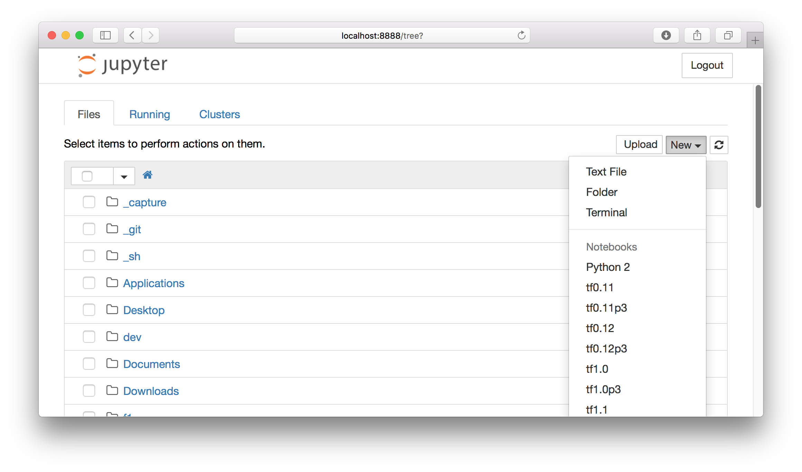

# Tensorflow Install Script.  MultiVersion Support With Jupyter

# Support OS
* OSX 10.12~ (cuda installed)
* Ubuntu 16.04.1~ (cuda installed,CuDNN installed)

This git repository is install script for our project.

# Usage
## for Ubuntu
```bash
git clone https://github.com/Finfra/TensorflowInstallMultiVersionWithJupyter.git
cd TensorflowInstallMultiVersionWithJupyter
. tensorflowInstallLinux.sh

workon
workon tf1.0
jupyter notebook --ip=0.0.0.0 --no-browser
```

## for Mac
```bash
git clone https://github.com/Finfra/TensorflowInstallMultiVersionWithJupyter.git
cd TensorflowInstallMultiVersionWithJupyter
. tensorflowInstallOsx.sh

workon
workon tf1.0
jupyter notebook --ip=0.0.0.0 --no-browser
```


* **Warning** : Ur virtualenvs will be delete(tf0.11 tf0.11p3 tf0.12 tf0.12p3 tf1.0 tf1.0p3 tf1.1  tf1.1p3)

# Result

```
[  ~ ]$ . tensorflowInstallOsx.sh
rm ~/.virtualenvs/tf0.11
rm: /Users/nowage/.virtualenvs/tf0.11: is a directory
rm ~/.virtualenvs/tf0.11p3
            <<~ Omitted ~>>
0.11.0 sys.version_info(major=2, minor=7, micro=13, releaselevel='final', serial=0)
0.11.0 sys.version_info(major=3, minor=5, micro=2, releaselevel='final', serial=0)
0.12.1 sys.version_info(major=2, minor=7, micro=13, releaselevel='final', serial=0)
0.12.1 sys.version_info(major=3, minor=5, micro=2, releaselevel='final', serial=0)
1.0.1 sys.version_info(major=2, minor=7, micro=13, releaselevel='final', serial=0)
1.0.1 sys.version_info(major=3, minor=5, micro=2, releaselevel='final', serial=0)
1.1.0-rc1 sys.version_info(major=2, minor=7, micro=13, releaselevel='final', serial=0)
1.1.0-rc0 sys.version_info(major=3, minor=5, micro=2, releaselevel='final', serial=0)
```

# Virtualenv List
|Python Virtual Enviroment Name|Tensorflow Version  |Python Version|
|------------------------------|--------------------|---------------|
|tf0.11p27|0.11|Python 2.7|
|tf0.11p35|0.11|Python 3.5|
|tf0.12p27|0.12|Python 2.7|
|tf0.12p35|0.12|Python 3.5|
|tf1.0p27 |1.0 |Python 2.7|
|tf1.0p35 |1.0 |Python 3.5|
|tf1.1p27 |1.1 |Python 2.7|
|tf1.1p35 |1.1 |Python 3.5|
|tf1.2p27 |1.2 |Python 2.7|
|tf1.2p35 |1.2 |Python 3.5|
|tf1.3p27 |1.3 |Python 2.7|
|tf1.3p35 |1.3 |Python 3.5|
|tf1.4p27 |1.4 |Python 2.7|
|tf1.4p35 |1.4 |Python 3.5|


# BUGS

Please report bugs to nowage[at]gmail.com.

# todo
- Mac Version is not updated(tf1.2p27,tf1.2p35,tf1.3p27,tf1.3p35,tf1.4p27,tf1.4p35)


# CONTRIBUTING

The github repository is at https://github.com/Finfra/TensorflowInstallMultiVersionWithJupyter

# SEE ALSO

Some other stuff.

# AUTHOR

NamJungGu, <nowage[at]gmail.com>

# COPYRIGHT AND LICENSE

(c) Copyright 2005-2017 by finfra.com
